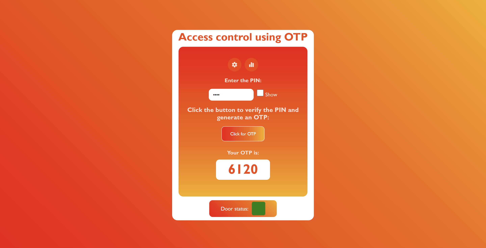
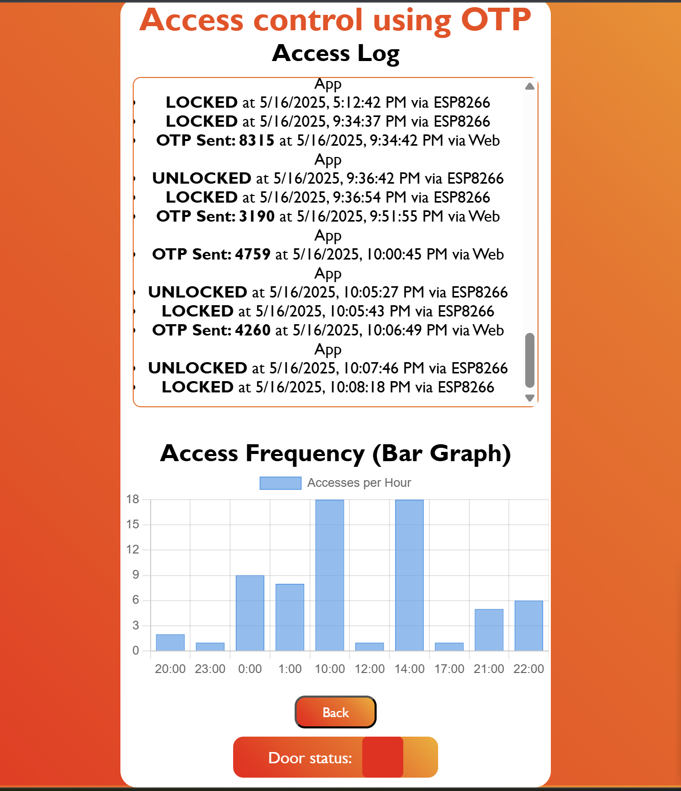

# IoT-Based Access Control Dashboard

A web-based dashboard for an OTP-enabled IoT access control system, built using HTML, CSS, JavaScript, and Firebase.  
The dashboard interacts with an ESP8266 microcontroller to generate OTPs, monitor door status, and log access events in real time.

## Overview

This project is part of an IoT-based access control system where user authentication is handled through OTP verification.  
The web dashboard allows authorized users to verify a PIN, generate OTPs, monitor door lock/unlock status, and analyze access logs.
Firebase Realtime Database is used as the communication layer between the web application and the ESP8266, enabling real-time synchronization of events.
This project was made as the software part of a larger IoT system project.

## Features

- PIN-based authentication before OTP generation
- Secure OTP generation via web interface
- Real-time communication with ESP8266 using Firebase
- Live door status indication (Locked / Unlocked)
- Access log storage with timestamps
- Separate logs for Web App and ESP8266 actions
- Visual access analysis using bar charts
- PIN update functionality through settings panel
- Clean and responsive dashboard UI

## Tech Stack

**Frontend**
- HTML
- CSS
- JavaScript (ES Modules)

**Backend / Cloud**
- Firebase Realtime Database

**Visualization**
- Chart.js

**Hardware Integration**
- ESP8266 microcontroller

## System Working (Brief)

- User enters a secure PIN on the dashboard
- On successful verification, a random 4-digit OTP is generated
- The OTP is sent to Firebase and read by the ESP8266
- ESP8266 verifies OTP input and updates door state
- Door lock/unlock actions are pushed back to Firebase
- The dashboard listens to these updates and logs them in real time
- Access data is visualized using a bar chart for analysis

## Screenshots

### OTP Dashboard

### Access Logs & Analysis

## How to Run

1. Clone the repository:
2. Open the project folder
3. Open index.html in a browser
4. Configure Firebase
